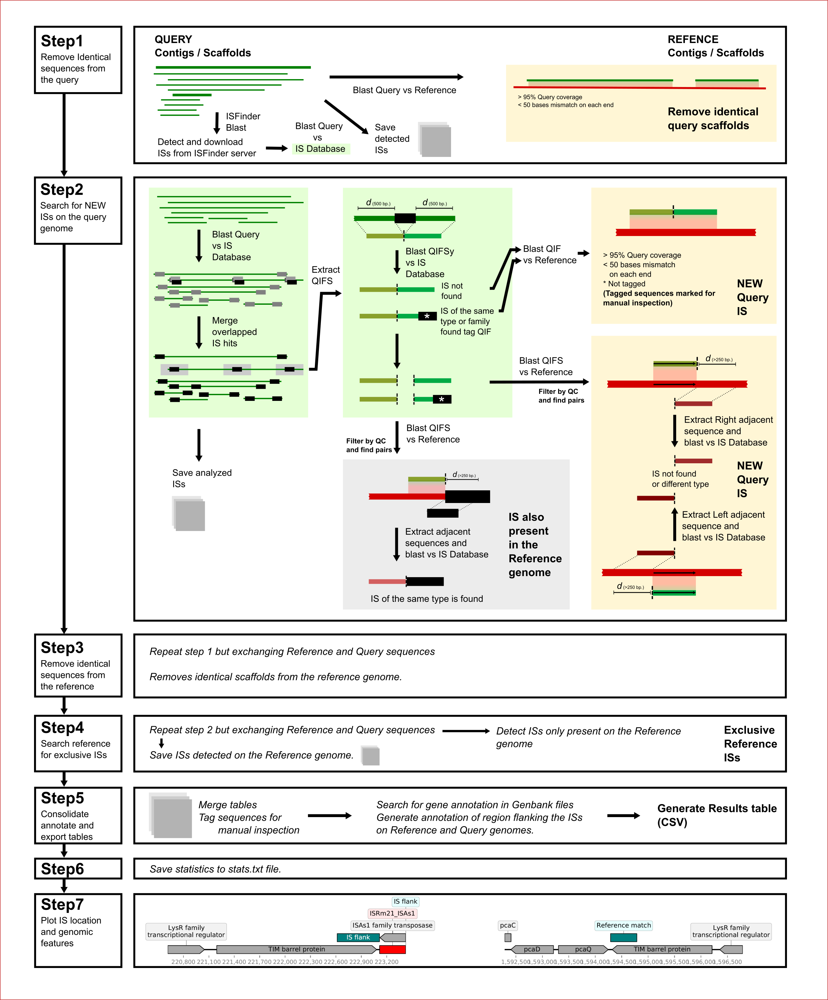
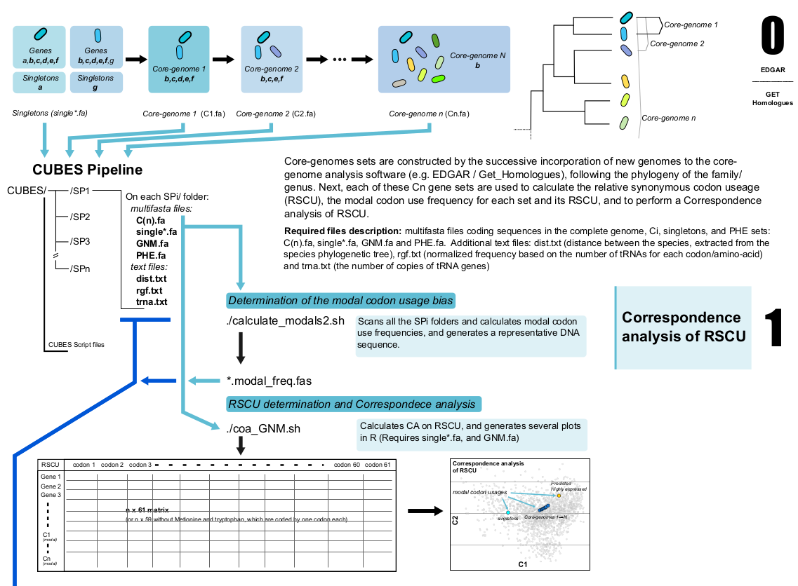
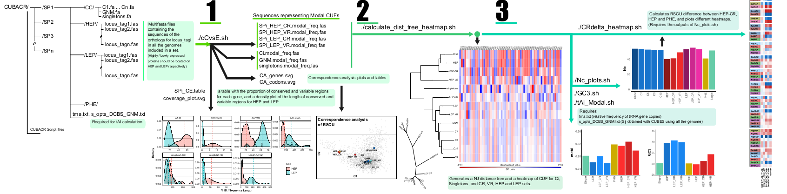

Plant associated soil microbial genetics and molecular ecology lab 
============================
This website presents the software developed by Mauricio J. Lozano and collaborators at the Plant associated soil microbial genetics and molecular ecology lab from the IBBM.
Mauricio J. Lozano is a researcher at the *Instituto de Biotecnología y Biología Molecular* (IBBM) which belongs to the National research council (CONICET) of Argentina and the National University of La Plata.
  
Mauricio's research career began with the study of early molecular determinants of the symbiosis between rhizobia and legume plants, at Antonio Lagares's LAB. He focused on molecular biology techniques aimed at the discovery of genes induced during the interaction of the symbiotic partners. During his PhD, he adapted a RIVET (Recombination based *in vivo* expression technology) approach for the study of *E. meliloti* interaction with *Medicago sativa*. Several variants were constructed, including one based on transposition.
There after, in collaboration with Dr. Eugenia Salas (a past member and PhD student at Lagares's LAB) they used STM (Signature-Tagged mutagenesis) coupled to next-generation sequencing to discover genes which mutation led to an altered root colonization competitiveness phenotype.
During this work Mauricio developed Perl scripts for the analysis of the raw sequence reads. These scripts were required for the classification of reads by mutant mixture and test condition. [STM-seq-count](https://github.com/maurijlozano/STM-seq-count)  
  
Another research line at Lagares's LAB was studying horizontal gene transfer on the *Ensifer* genus, and after purifying and sequencing a collection of high molecular weight plasmids, José Luis López and Antonio began to analyze the codon usage patterns of these mobilome. On these work, the authors describe the different genetic composition, and codon usage bias of *E. meliloti* chromosome, megaplasmids, and accessory plasmids. Here, a set of scripts which then became [CUBES](#id1) began to be developed, using linux bash and R for graphics and matrix manipulations.

During the COVID-19 period, a project to find differentially located ISs on bacteria originated the development of [ISCompare](#ISC). ISCompare is now published on BioRxiv.

## ISCompare: a new tool for the identification of differentially located insertion sequences on bacteria
Bacterial genomes are composed by a core and an accessory genome. The first composed of housekeeping and essential genes, while the second is composed, in its majority, of mobile genetic elements, including transposable elements (Tes). Insertion sequences (ISs) are the smallest TEs formed by imperfect terminal inverted repeats (IRs) and a transposase. ISs are relevant because they have an important role in genome evolution, and contribute to bacterial genome plasticity and adaptability. ISs can spread in a genome, presenting different locations in nearly related strains, and producing phenotypic variations. We developed ISCompare to profile IS mobilization events in related bacterial strains. ISCompare uses blastn to look for ISs on a query genome assembly, extracts the IS flanks and maps them to the reference genome. After filtering and analysis steps, a list of differentially located ISs is reported. ISCompare was validated using artificial genomes with simulated random IS insertions and real sequences from Escherichia coli, Pseudomonas aeruginosa, Bordetella pertussis and Ensifer meliloti. In the first case, ISCompare performed very well, achieving high precision (100%) and sensitivity (94%). For real genomes a precision greater than 89% in average was observed, false positive arising mostly from consecutive IS insertions and repeated sequences. Finally we compared ISCompare with ISSeeker, achieving the same or better results, with the advantage that ISCompare can analyse multiple ISs at the same time, and direclty reports list of candidate DLIS. We think that ISCompare provides an easy and straightforward approach to look for differentially located ISs on bacterial genomes. 
**BioRxiv article**: [Here](https://doi.org/10.1101/2020.10.16.342287). Currently in press in G3 - Genes, Genomes, Genetics.
  

## CUBES
  

Codon Usage Bias Evolutionary Scripts ([CUBES](https://github.com/maurijlozano/CUBES)) is a software package designed to study the evolutionary traits of codon bias. To that end, a set of progressively ancestral core-genomes must first be obtained using for example Edgar or Get-Homologues software. The core-genome sets (e.g. C1 -> Cn) are constructed by the successive incorporation of more distantly related genomes -following the phylogeny of the family/genus- to the analysis. Next, these Cn gene sets are used to calculate the modal codon use frequencies (for each set), the relative synonymous codon use (RSCU, for each gene), and to perform a Correspondence analysis. Additionally, tools to analyse the evolutionary traits of codon bias are provided.
  

## CUBACR
  

Codon Usage Bias analysis - Conserved Regions ([CUBACR](https://github.com/maurijlozano/CUBACR)): is a set of scripts for the codon usage bias analysis of Conserved and Variable regions from core genome proteins.
CUBACR scripts are programmed to process multifasta files containing ortholog genes of the desired core-gene set (or corresponding to proteins with a defined expression level), make an amino acid guided codon alignment for each gene (using TranslatorX software), and to output the conserved and variable regions of all genes on the core-genome set.  

### Poster at A2B2C 2019
[Download the Poster!](poster_lozano.pdf)

## Publications

* Albicoro FJ, Draghi WO, Martini MC, Salas ME, Torres Tejerizo GA, **Lozano MJ**, López JL, Vacca C, Cafiero JH, Pistorio M, Bednarz H, Meier D, Lagares A, Niehaus K, Becker A, Del Papa MF. The two-component system ActJK is involved in acid stress tolerance and symbiosis in Sinorhizobium meliloti. J Biotechnol. 2021 Mar 10;329:80-91. doi: 10.1016/j.jbiotec.2021.01.006. Epub 2021 Feb 2. PMID: 33539896.
* Lopez, J.L; **Lozano, M.J**; Fabre, M.L; y A. Lagares. Codon Usage Optimization in the Prokaryotic Tree of Life: How Synonymous Codons Are Differentially Selected in Sequence Domains with Different Expression Levels and Degrees of Conservation. mBIO. July/August 2020 Volume 11 Issue 4 e00766-20. *José Luis López and Mauricio Javier Lozano contributed equally to this work. Author order was determined alphabetically. DOI:10.1128/mBio.00766-20
* López, J.L., **Lozano, M.J.**, Lagares, A., Fabre, M.L., Draghi, W.O., Del Papa, M.F., Pistorio, M., Becker, A., Wibberg, D., Schlüter, A., Pühler, A., Blom, J., Goesmann, A., Lagares, A., 2019. Codon Usage Heterogeneity in the Multipartite Prokaryote Genome: Selection-Based Coding Bias Associated with Gene Location, Expression Level, and Ancestry. [MBio 10, 1–20.](https://doi.org/10.1128/mBio.00505-19)
* López, J.L., Alvarez, F., Príncipe, A., Salas, M.E., **Lozano, M.J.**, Draghi, W.O., Jofré, E., Lagares, A., **2018**. *Isolation, taxonomic analysis, and phenotypic characterization of bacterial endophytes present in alfalfa (Medicago sativa) seeds.* [J. Biotechnol. 267, 55–62.](https://doi.org/10.1016/j.jbiotec.2017.12.020)
* Draghi, W.O., Del Papa, M.F., Barsch, A., Albicoro, F.J., **Lozano, M.J.**, Pühler, A., Niehaus, K., Lagares, A., **2017.** *A metabolomic approach to characterize the acid-tolerance response in Sinorhizobium meliloti.* [Metabolomics 13, 1–12.](https://doi.org/10.1007/s11306-017-1210-2)
* Salas, M.E., **Lozano, M.J.**, López, J.L., Draghi, W.O., Serrania, J., Torres Tejerizo, G.A., Albicoro, F.J., Nilsson, J.F., Pistorio, M., Del Papa, M.F., Parisi, G., Becker, A., Lagares, A., **2017.** *Specificity traits consistent with legume-rhizobia coevolution displayed by Ensifer meliloti rhizosphere colonization.* [Environ. Microbiol. 19, 3423–3438.](https://doi.org/10.1111/1462-2920.13820)
* Martini, M.C., Wibberg, D., **Lozano, M.**, Torres Tejerizo, G., Albicoro, F.J., Jaenicke, S., van Elsas, J.D., Petroni, A., Garcillán-Barcia, M.P., de la Cruz, F., Schlüter, A., Pühler, A., Pistorio, M., Lagares, A., Del Papa, M.F., **2016**. *Genomics of high molecular weight plasmids isolated from an on-farm biopurification system.* [Sci. Rep. 6, 28284.](https://doi.org/10.1038/srep28284)
* Draghi, W.O., Del Papa, M.F., Hellweg, C., Watt, S.A., Watt, T.F., Barsch, A., **Lozano, M.J.**, Lagares, A., Salas, M.E., López, J.L., Albicoro, F.J., Nilsson, J.F., Torres Tejerizo, G.A., Luna, M.F., Pistorio, M., Boiardi, J.L., Pühler, A., Weidner, S., Niehaus, K., Lagares, A., **2016**. *A consolidated analysis of the physiologic and molecular responses induced under acid stress in the legume-symbiont model-soil bacterium Sinorhizobium meliloti.* [Sci. Rep. 6, 29278.](https://doi.org/10.1038/srep29278)
* Pistorio, M., Torres Tejerizo, G.A., Del Papa, M.F., de los Angeles Giusti, **M., Lozano**, M., Lagares, A., Giusti Mde, L., Lozano, M., Lagares, A., **2013**. *rptA, a novel gene from Ensifer (Sinorhizobium) meliloti involved in conjugal transfer.* [FEMS Microbiol. Lett. 345, 22–30.](https://doi.org/10.1111/1574-6968.12177)
* **Lozano, M.J.**, Salas, M.E., Giusti Mde, L., Martini, M.C., Lopez, J.L., Salto, I., Del Papa, M.F., Pistorio, M., Lagares, A., **2013.** *Novel tnpR-based transposable promoter traps suitable for RIVET studies in different gram-negative bacteria.* [J Microbiol Methods 93, 9–11.](https://doi.org/10.1016/j.mimet.2013.01.017)
* Giusti, M. de los Á., **Lozano, M.J.**, Torres Tejerizo, G.A., Martini, M.C., Salas, M.E., López, J.L., Draghi, W.O., Del Papa, M.F., Pistorio, M., Lagares, A., **2013.** *Conjugal transfer of a Sinorhizobium meliloti cryptic plasmid evaluated during a field release and in soil microcosms.* [Eur. J. Soil Biol. 55, 9–12.](https://doi.org/http://dx.doi.org/10.1016/j.ejsobi.2012.11.005)
* Giusti, M. de los ángeles, Pistorio, M., **Lozano, M.J.**, Torres Tejerizo, G.A., Salas, M.E., Martini, M.C., López, J.L., Draghi, W.O., Del Papa, M.F., Pérez-Mendoza, D., Sanjuán, J., Lagares, A., **2012**. G*enetic and functional characterization of a yet-unclassified rhizobial Dtr (DNA-transfer-and-replication) region from a ubiquitous plasmid conjugal system present in Sinorhizobium meliloti, in Sinorhizobium medicae, and in other nonrhizobial Gram-negative.* [Plasmid 67, 199–210.](https://doi.org/10.1016/j.plasmid.2011.12.010)
* Tejerizo, G.T., Del Papa, M.F., Eugenia Soria-Diaz, M., Draghi, W., **Lozano, M.**, Giusti, M.D.L.Á., Manyani, H., Megías, M., Serrano, A.G., Pühler, A., Niehaus, K., Lagares, A., Pistorio, M., Torres Tejerizo, G., Del Papa, M.F., Soria-Diaz, M.E., Draghi, W., Lozano, M., Giusti Mde, L., Manyani, H., Megias, M., Gil Serrano, A., Puhler, A., Niehaus, K., Lagares, A., Pistorio, M., **2011**. *The nodulation of alfalfa by the acid-tolerant Rhizobium sp. strain LPU83 does not require sulfated forms of lipochitooligosaccharide nodulation signals.* [J. Bacteriol. 193, 30–39.](https://doi.org/10.1128/JB.01009-10)
* Tejerizo, G.T., Del Papa, M.F., Draghi, W., **Lozano, M.**, Giusti Mde, L., Martini, C., Salas, M.E., Salto, I., Wibberg, D., Szczepanowski, R., Weidner, S., Schluter, A., Lagares, A., Pistorio, M., Torres Tejerizo, G., Del Papa, M.F., Draghi, W., Lozano, M., Giusti, M. de los Á., Martini, C., Salas, M.E., Salto, I., Wibberg, D., Szczepanowski, R., Weidner, S., Schlüter, A., Lagares, A., Pistorio, M., **2011**. *First genomic analysis of the broad-host-range Rhizobium sp. LPU83 strain, a member of the low-genetic diversity Oregon-like Rhizobium sp. group.* [J. Biotechnol. 155, 3–10.](https://doi.org/10.1016/j.jbiotec.2011.01.011)
* **Lozano, M.J.**, Salas, M.E., Giusti, M. a, Draghi, W.O., Torres Tejerizo, G. a, Martini, M.C., Del Papa, M.F., Pistorio, M., Lagares, A, **2011**. *Development of new positive-selection RIVET tools: detection of induced promoters by the excision-based transcriptional activation of an aacCI (GmR)-gfp fusion.* [J. Biotechnol. 155, 147–55.](https://doi.org/10.1016/j.jbiotec.2011.06.014)
* Torres Tejerizo, G., Florencia Del Papa, M., de los Ángeles Giusti, M., Draghi, W., **Lozano, M.**, Lagares, A., Pistorio, M., Del Papa, M.F., de los Angeles Giusti, M., Draghi, W., Lozano, M., Lagares, A., Pistorio, M., Florencia Del Papa, M., de los Ángeles Giusti, M., Draghi, W., Lozano, M., Lagares, A., Pistorio, M., Del Papa, M.F., de los Angeles Giusti, M., Draghi, W., Lozano, M., Lagares, A., Pistorio, M., **2010**. *Characterization of extrachromosomal replicons present in the extended host range Rhizobium sp. LPU83.* [Plasmid 64, 177–185.](https://doi.org/10.1016/j.plasmid.2010.07.004)
* Draghi, W.O., Del Papa, M.F., Pistorio, M., **Lozano, M.**, De Los Ángeles Giusti, M., Torres Tejerizo, G.A., Jofré, E., Boiardi, J.L., Lagares, A., de Los Angeles Giusti, M., Torres Tejerizo, G.A., Jofre, E., Boiardi, J.L., Lagares, A., **2010.** *Cultural conditions required for the induction of an adaptive acid-tolerance response (ATR) in Sinorhizobium meliloti and the question as to whether or not the ATR helps rhizobia improve their symbiosis with alfalfa at low pH.* [FEMS Microbiol Lett 302, 123–130.](https://doi.org/10.1111/j.1574-6968.2009.01846.x)
* Pistorio, M., Giusti, M.A., Del Papa, M.F., Draghi, W.O., **Lozano, M.J.**, Tejerizo, G.T., Lagares, A., **2008**. *Conjugal properties of the Sinorhizobium meliloti plasmid mobilome.* [FEMS Microbiol Ecol 65, 372–382.]( https://doi.org/10.1111/j.1574-6941.2008.00509.x)
* Del Papa, M.F., Pistorio, M., Draghi, W.O., **Lozano, M.J.**, Giusti, M.A., Medina, C., van Dillewijn, P., Martinez-Abarca, F., Moron Flores, B., Ruiz-Sainz, J.E., Megías, M., Pühler, A., Niehaus, K., Toro, N., Lagares, A., **2007**. *Identification and characterization of a nodH ortholog from the alfalfa-nodulating Or191-like rhizobia.* [Mol Plant Microbe Interact 20, 138–145.](https://doi.org/10.1094/MPMI-20-2-0138)
